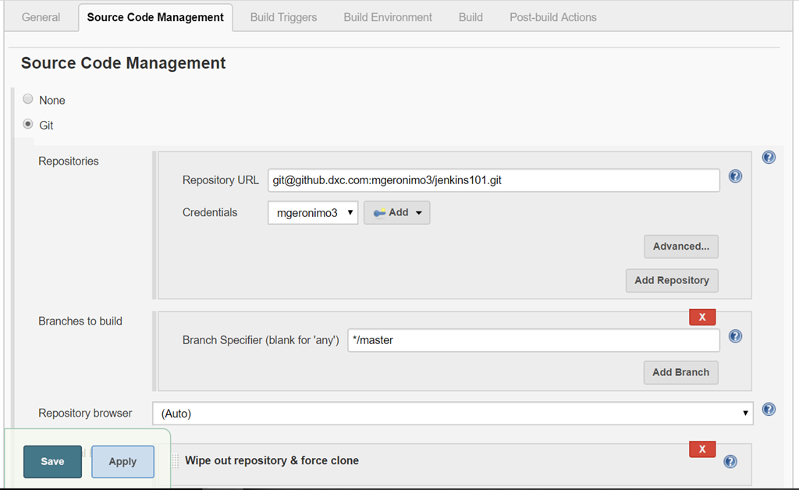
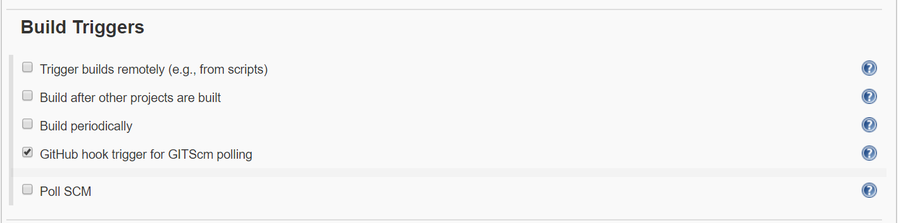
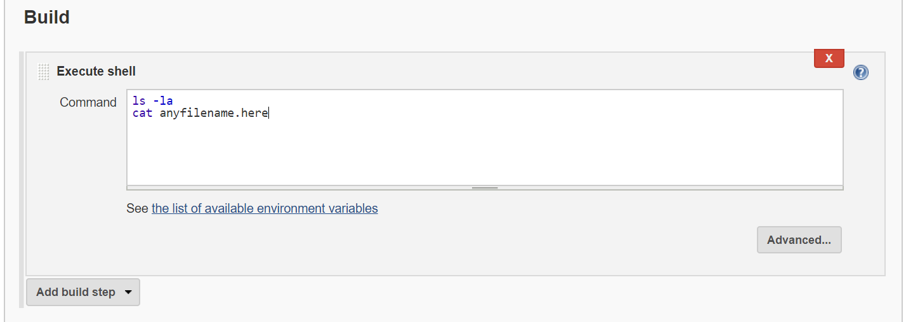

# Setup Github and Jenkins Integration

 | 
---

### Setup Jenkins in AWS EC2
1. Create an AWS EC2 Instance (Amazon Linux). Allow inbound rules on port 8080 and 22.
2. SSH to the EC2 instance and install docker
   ``` sh
   ssh -i yourkey.pem ec2-user@ec2-13-229-128-99.ap-southeast-1.compute.amazonaws.com
   ```
3. Install docker in EC2
   ``` sh
   sudo yum update -y
   sudo yum install docker -y
   sudo service docker start
   sudo systemctl enable docker
   sudo usermod -aG docker ec2-user
   ```
4. Re-login your EC2 instance
5. Install jenkins via docker
   ``` sh
   mkdir ~/jenkins_dir
   docker run -d --name jenkins \
    -v ~/jenkins_dir:/var/jenkins_home \
    -p 8080:8080 -p 50001:50001 \
    --env JENKINS_SLAVE_AGENT_PORT=50001 \
    jenkins/jenkins:lts
   ```
6. Tail the logs until it shows Jenkins is running
   ``` sh
   docker logs -f jenkins
   ```
7. Get the initial password of Jenkins Admin
   ``` sh
   jenkinsPassword=$(docker exec -it jenkins cat /var/jenkins_home/secrets/initialAdminPassword)
   echo $jenkinsPassword
   ```
8. Access your Jenkins URL, and install the default plugins. Create your first Admin User

### Setup your Github repository and add webhook
1. Login to your DXC github and create a new repository for this exercise
2. In **Settings**, click **Hooks** to add a new webhook
3. Add your Jenkins URL and append **github-webhook/**
   - Example: http://ec2-13-229-128-99.ap-southeast-1.compute.amazonaws.com:8080/github-webhook/
4. Change the content-type to **application/json**, then at the bottom click **Add Webhook**

### Create a Personal Access Token for Git Polling
1. Login to your DXC github and click your profile icon on the **upper right** and click **Settings**
2. Click **Developer Settings** and then **Personal Access Token**
3. Input a description and check **repo** and **admin:repo_hook**
4. Click generate token. Don't forget to copy and save the token

### Create Jenkins PAN Credentials
1. Login to Jenkins
2. Click Credentials -> Global
3. Select **Secret Text**, paste the token and add a name.
4. Save your new credential

### Create Jenkins SSH Credentials
1. Login to Jenkins
2. Click Credentials -> Global
3. Select **SSH**, paste your SSH private key that is also linked in your github account
4. Add your github username and save the credential

### Create Jenkins job
1. Login to Jenkins
2. Click Add new job
---
3. 
---
4. 
---
5. 
